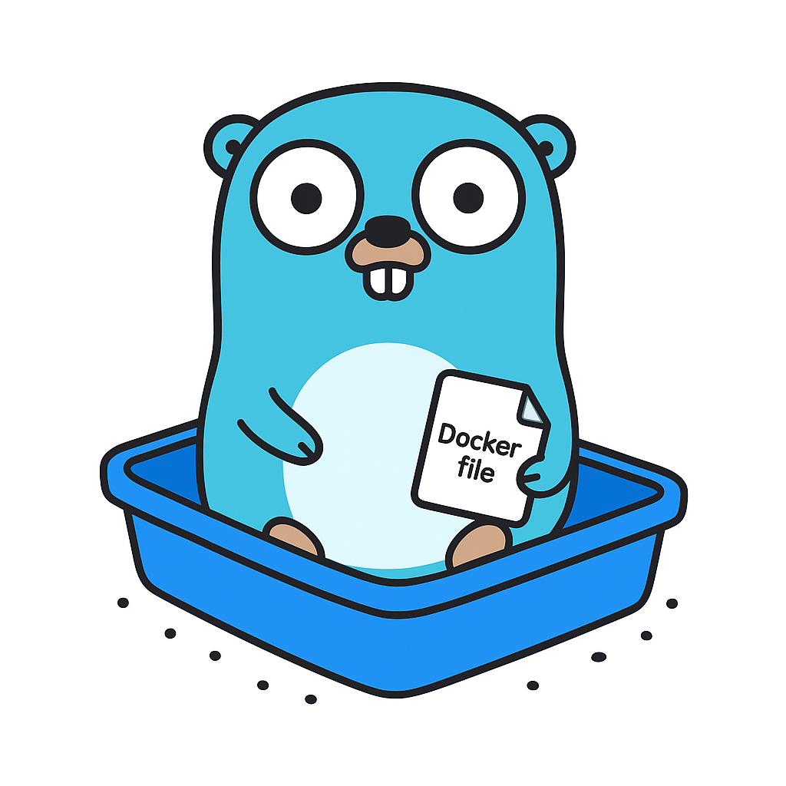

# godolint

> Same shit, different language



## godolint? hadolint?

This project is a (loving and) friendly port of hadolint, a venerable and wildly used dockerfile linter
written in haskell.

While there is nothing wrong with hadolint in itself, it does not fit quite well inside the
go devtools ecosytem:
- it is a foreign dependency, that has to be handled outside the familiar go toolchain
- it comes as a binary, that you have to shell out to, and parse its output
- modifying it or extending it requires haskell knowledge (which might be a foreign proposition for some gophers),
and maintaining a fork

godolint is a pure go port of hadolint, filling an age-old gap in the container tooling landscape:
the ability to lint dockerfiles in go.

It comes with an example binary that mimicks hadolint behavior, and can also be used (of course,
and primarily) as a library, integrated into other go projects and devtools.

## Installation

### As a CLI tool

```bash
go install github.com/farcloser/godolint/cmd/godolint@latest
```

### As a library

```bash
go get github.com/farcloser/godolint
```

## Quick Start

### CLI Usage

```bash
# Lint a Dockerfile
godolint Dockerfile

# Output: JSON array of violations
# [
#   {
#     "Code": "DL3007",
#     "Severity": "warning",
#     "Message": "Using latest is prone to errors if the image will ever update",
#     "Line": 1
#   }
# ]
```

### Library Usage

```go
package main

import (
    "fmt"
    "os"

    "github.com/farcloser/godolint/internal/parser"
    "github.com/farcloser/godolint/internal/process"
    "github.com/farcloser/godolint/internal/rule"
    "github.com/farcloser/godolint/internal/rules"
)

func main() {
    // Read Dockerfile
    content, _ := os.ReadFile("Dockerfile")

    // Parse
    p := parser.NewBuildkitParser()
    instructions, _ := p.Parse(content)

    // Configure rules
    myRules := []rule.Rule{
        rules.DL3007(), // No latest tag
        rules.DL3000(), // Absolute WORKDIR
        rules.DL3020(), // Use COPY not ADD
        rules.DL4000(), // No MAINTAINER
    }

    // Lint
    processor := process.NewProcessor(myRules)
    failures := processor.Run(instructions)

    // Report
    for _, f := range failures {
        fmt.Printf("%s (line %d): %s\n", f.Code, f.Line, f.Message)
    }
}
```

## Current Status

### Implemented Rules (4)

| Code | Severity | Description |
|------|----------|-------------|
| DL3007 | Warning | Using latest is prone to errors |
| DL3000 | Error | Use absolute WORKDIR |
| DL3020 | Error | Use COPY instead of ADD for files |
| DL4000 | Error | MAINTAINER is deprecated |

### Implementation Progress

- **Total rules**: 65 (matching hadolint)
- **Fully implemented**: 4 rules
- **Stubs generated**: 27 rules (ready for implementation)
- **Requires shell parsing**: 34 rules (blocked on shellcheck integration)

Test suite pass rate: **70%** (23/33 tests passing)

### Output Format

godolint outputs JSON arrays of violations:

```json
[
  {
    "Code": "DL3007",
    "Severity": "warning",
    "Message": "Using latest is prone to errors if the image will ever update",
    "Line": 1
  },
  {
    "Code": "DL3000",
    "Severity": "error",
    "Message": "Use absolute WORKDIR",
    "Line": 5
  }
]
```

Exit codes:
- `0`: No violations
- `1`: Violations found

## Architecture

### Parser

godolint uses [moby/buildkit](https://github.com/moby/buildkit) for parsing Dockerfiles, ensuring compatibility with Docker's official parser.

The parser interface is pluggable:

```go
type Parser interface {
    Parse(dockerfile []byte) ([]syntax.InstructionPos, error)
}
```

### Rule Engine

Rules implement a simple interface:

```go
type Rule interface {
    Code() RuleCode              // "DL3007"
    Severity() Severity          // Error, Warning, Info, Style
    Message() string             // Human-readable description
    Check(instruction) bool      // true=pass, false=fail
}
```

Each rule is stateless and validates individual Dockerfile instructions.

### Instruction Types

The AST covers all Dockerfile instructions:
- `FROM` (image, tag, digest, platform, alias)
- `RUN`, `CMD`, `ENTRYPOINT` (commands)
- `COPY`, `ADD` (sources, destination, flags)
- `ENV`, `ARG`, `LABEL` (key-value pairs)
- `WORKDIR`, `USER`, `EXPOSE`, `VOLUME`
- `HEALTHCHECK`, `STOPSIGNAL`, `SHELL`
- `MAINTAINER`, `ONBUILD`

## Rules & Tests

Rules and tests are (partly) generated from the hadolint codebase.

As such, godolint passes hadolint's internal test suite, (hopefully) guaranteeing
a seamless transition.

Further, as we do not plan on fragmenting the ecosystem for no good reason, we use exactly the same rules,
and plan on keeping up with hadolint's updated/new rules.

### Code Generation

Rule stubs and tests are auto-generated from hadolint's Haskell source:

```bash
# Generate rule stubs and tests (runs both generators)
go generate ./internal/rules
```

This single command:
- Extracts rule metadata (code, severity, message) from Haskell source
- Generates Go function stubs for unimplemented rules
- Converts Haskell test cases to Go tests for implemented rules
- Reports implementation status

## Development

### Build

```bash
# Build CLI binary
make build
# Output: ./bin/godolint

# Or directly
go build -o godolint ./cmd/godolint
```

### Test

```bash
# Run all tests
make test

# Run specific rule tests
go test ./internal/rules -run DL3007
```

### Lint

```bash
# Install dev tools
make install-dev-tools

# Run linters
make lint
```

### Adding New Rules

1. Check if rule stub exists in `internal/rules/dlXXXX.go`
2. If not, run `go generate ./internal/rules` to generate stub
3. Implement the `checkDLXXXX` function
4. Add rule to `cmd/godolint/main.go` registration
5. Run tests: `go test ./internal/rules -run DLXXXX`

Example:

```go
// internal/rules/dl3007.go
func checkDL3007(instruction syntax.Instruction) bool {
    from, ok := instruction.(*syntax.From)
    if !ok {
        return true // Not a FROM instruction, passes
    }

    // Fail if using :latest tag
    if from.Image.Tag != nil && *from.Image.Tag == "latest" {
        return false
    }

    return true
}
```

## Roadmap

### Short-term
- [ ] Implement remaining 27 simple rule stubs
- [ ] Improve test pass rate to 100%
- [ ] Add CLI flags (verbosity, rule selection, output format)
- [ ] Configuration file support (YAML/TOML)
- [ ] Pragma support (`# godolint ignore=DL3007`)

### Medium-term
- [ ] Shellcheck integration for 34 shell-dependent rules
- [ ] Alternative output formats (SARIF, human-readable TTY)
- [ ] Stateful rule processor for cross-instruction validation
- [ ] Performance optimization

### Long-term
- [ ] Plugin architecture for custom rules
- [ ] Integration with container build tools
- [ ] Language-agnostic rule repository

## Limitations

### Current
- **No configuration file support** (hardcoded rules)
- **No pragma/inline ignore directives**
- **JSON output only**
- **No CLI flags** (except file path)

### Parser Differences
- Quote handling differs slightly from hadolint (buildkit includes quotes in values)
- Some escape sequences handled differently
- Affects ~30% of auto-generated test cases

### Rule Coverage
- **4 rules** fully implemented
- **27 rules** have stubs (need implementation)
- **34 rules** require shell parsing integration

## Contributing

Contributions welcome! Areas needing help:
- Implementing rule stubs (`internal/rules/dlXXXX.go`)
- Fixing test failures (quote handling, edge cases)
- Shellcheck integration
- Configuration file support
- Alternative output formats

## License

See LICENSE file.

